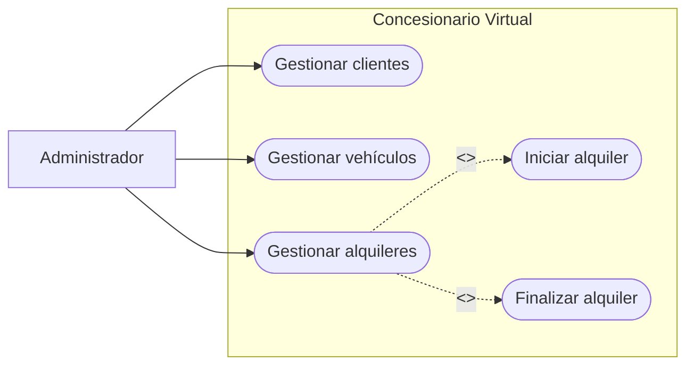
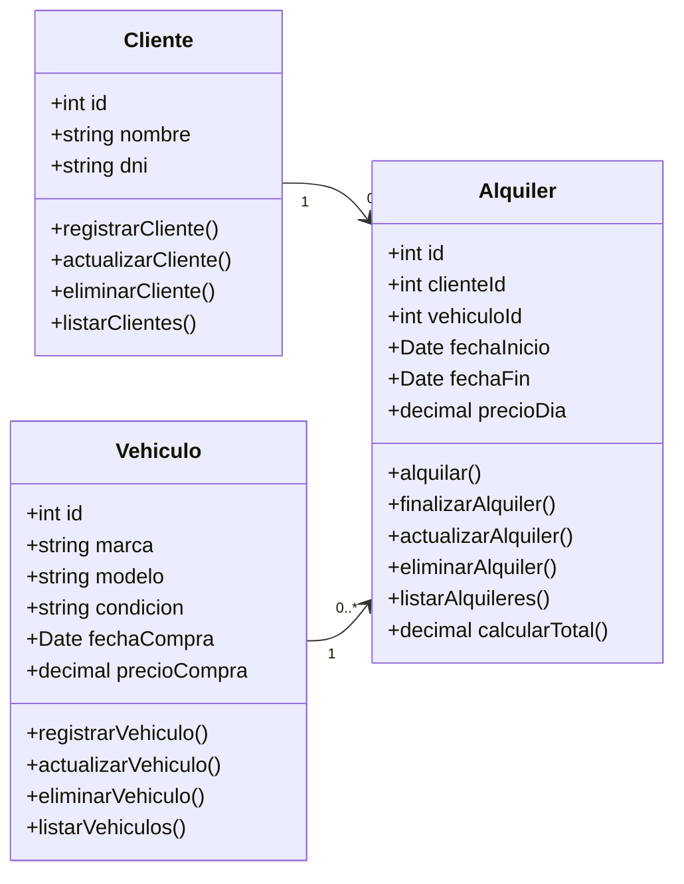
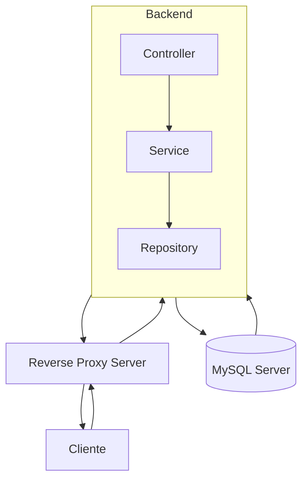
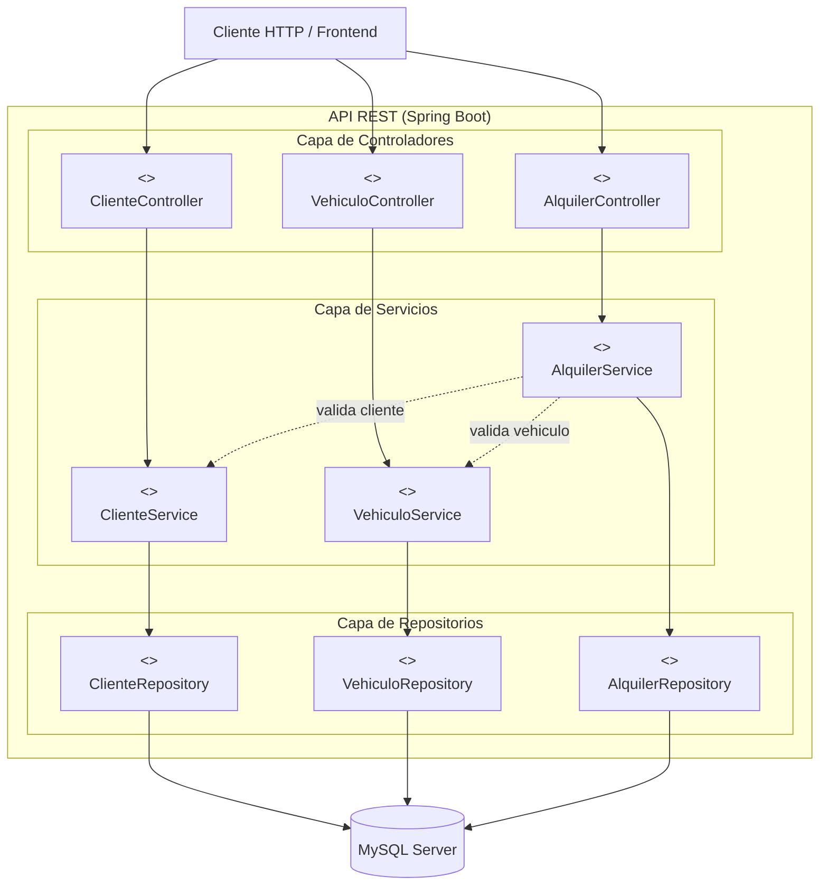

## Diseño funcional

### Descripción

El concesionario virtual es una herramienta para gestionar la información y operaciones de un negocio de compra y alquiler de vehículos.

### Requisitos funcionales

| RF1 | El sistema debe permitir registrar nuevos clientes con su nombre y DNI. |
| --- | --- |
| RF2 | El sistema debe permitir listar, editar o eliminar la información de cada cliente |
| RF3 | El sistema debe permitir registrar un vehículo en el inventario por su modelo, estado, fecha de compra y precio de compra |
| RF4 | El sistema debe permitir listar, editar o eliminar la información de cada vehículo |
| RF5 | El sistema debe permitir registrar el inicio de un alquiler de un vehículo ingresando el cliente, la fecha de inicio y tarifa diaria |
| RF6 | El sistema debe permitir registrar la finalización de un alquiler ingresando la fecha de finalización |
| RF7 | El sistema debe calcular el monto a cancelar de un alquiler en función de los días transcurridos entre la fecha de inicio y la de finalización |
| RF8 | El sistema debe permitir listar, editar o eliminar la información de los alquileres |
| RF9 | Al listar los alquileres, el sistema debe mostrar el estado de un alquiler dependiendo de la presencia o ausencia de una fecha de finalización |

### Requisitos no funcionales

| RNF1 | Se debe usar MySQL como base de datos |
| --- | --- |
| RNF2 | Se debe exponer endpoints mediante una API REST |
| RNF3 | Usar lenguaje de programación JAVA y framework SPRING |
| RNF4 | Despliegue en nube |

### Diagrama de casos de uso

## Diseño de componentes

### Diagrama de clases

### Diagrama de arquitectura

Arquitectura en capas - Spring Framework

###